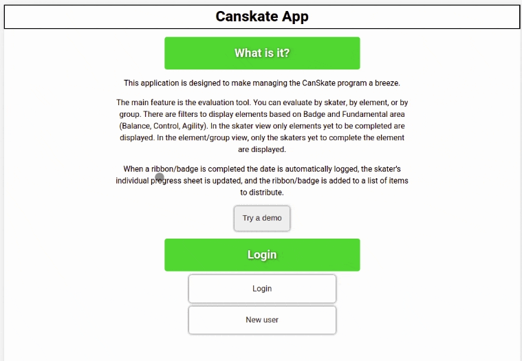
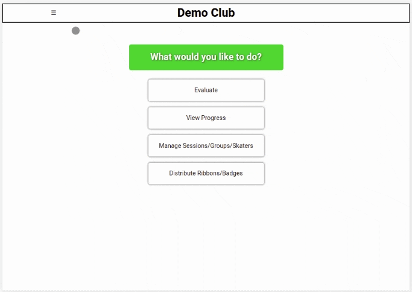
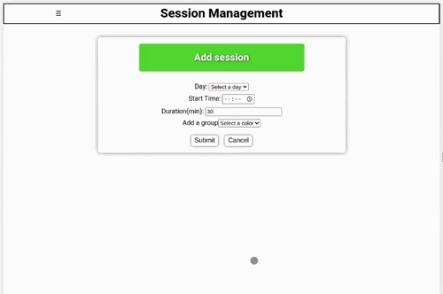
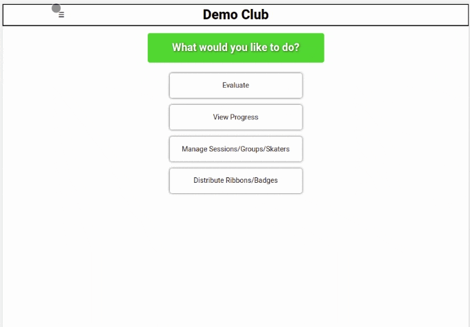
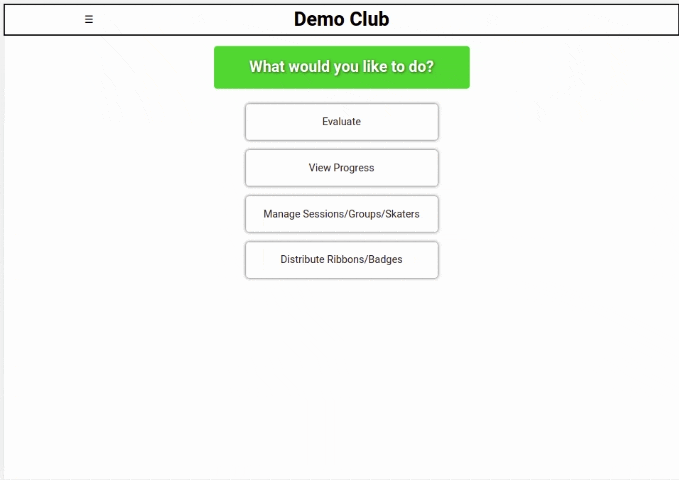
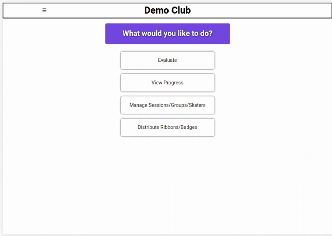
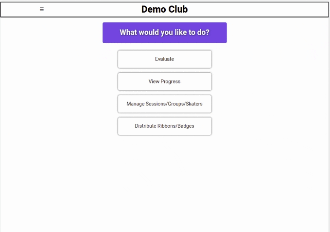

# CanSkate App

**[Live Site](https://canskate.vercel.app)**  
**[Server Repo](https://github.com/marcuses101/canskate-server)**

## Description

There are A LOT of things to track when organizing a [Skate Canada CanSkate Program](https://skatecanada.ca/learn-to-skate/canskate/). Sessions, groups, skaters, badges, categories, dates, etc. This web app aims to automate as many of the repetitive tasks as possible, allowing coaches to focus on what really matters: helping their students improve.

## How to use

---

### **Login**

Choose whether to try out the demo account, create a new account or login with a pre-existing account.  
  
**Demo Login**

---

### **Clubs**

Next you will have the option to either select a pre-existing club to manage, or to create a new club.

If you choose to create a new club enter the name of the club, submit, then select your newly created club from the list.

---

### **Sessions**

The first thing to do once you've created your new club is to add a session. Navigate from the side menu to **Manage>Manage Sessions>Add Session**. If you are setting up the club for the first time there will be a link directly to **Add Session**. Fill in the necessary info and submit to create the session. To edit details of the session navigate to **Manage>Manage Sessions>Add Session**.  

---

### **Skaters**

Next you will need to add your skaters. Navigate to **Manage>Manage Skaters>Add Skater**. Fill in the necessary information and submit. Skater info can be updated at **Manage>Manage Skaters>Edit Skater**.  
  
**Add Skater**

---

### **Assign Skaters to Groups**

To add a skater to a group navigate to **Manage>Manage Sessions>Assign Skaters to Groups**. Click on the skater you would like to assign, then click on the group you'd like to assign them to.  
  
**Assign Skater**

---

### **Evaluate by skater**

Navigate to **Evaluate>Skater** then choose the individual you'd like to evaluate from the list. You have the option to filter skaters by name. This view shows all of the elements the skater has yet to complete. There are filter options for the badge and fundamental areas (Balance, Control, Agility). Click on the **Progress** link near the top of the page to view elements, ribbons and badges that have already been completed, with their date of completion. Clicking on the elements marks them as complete. If the skater completed the elements necessary for a ribbon or badge it is also logged as complete, and is added to the Distribution list.  
  
**Evaluate Skater**

---

### **Evaluate by club**

Navigate to **Evaluate>Club**. This view shows all of the elements of the CanSkate Program, with the option to filter by badge and fundamental area (Balance, Control, Agility). Beside each element is the number of skaters yet to complete the element. Clicking the element shows a dropdown of skater. Click the skater to log the element as complete for that skater.  
  
**Evaluate Club**

---

### **Evaluate by group**

Navigate to **Evaluate>Group** then select the session then the group you want to evaluate. This page behaves like **Evaluate by Club**, but only shows the skaters assigned to the selected group.

---

### **Progress**

Navigate to **Progress**. Choose a skater to view their progress page. This page show what elements, ribbons, and badges the skater has completed as well as the date of completion.

---

### **Distribution**

Displays a list of completed badges and ribbons. Optionally filter by whether the item has yet to be distributed. Clicking the distribute button logs the date the ribbon or badge was handed out.  
  
**Distribute ribbon or badge**

---

## Tech

- HTML
- CSS
- JavaScript
- React.js

---

## Author Information

### Marcus Connolly

- [Portfolio](https://marcus-connolly.com)
- [LinkedIn](www.linkedin.com/in/marcus-connolly-web)
- [GitHub](www.github.com/marcuses101)
- [Email](mailto:mnjconnolly@gmail.com)
